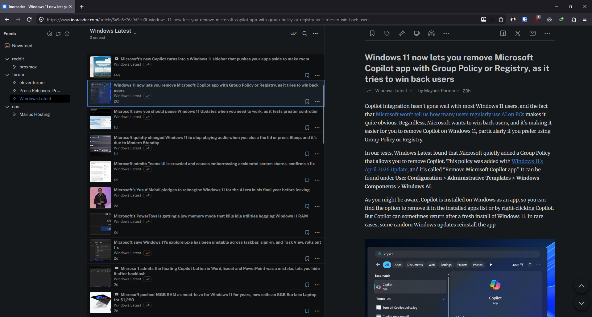
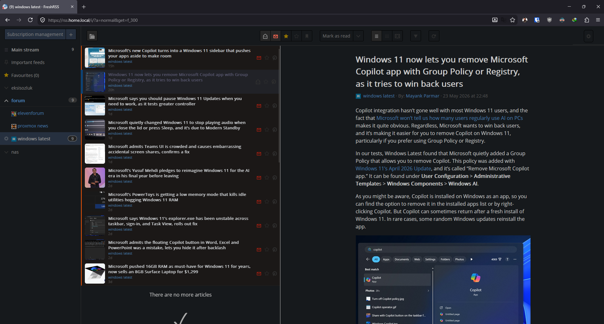

# xExtension-Inoreader

A [FreshRSS](https://freshrss.org/) extension that turns the default reading view into a
clean, **three‑pane [Inoreader](https://www.inoreader.com/)-style** interface: navigation on
the left, a compact article list in the middle, and the full article content in a third pane on
the right — no page reloads, no popups.

| Inoreader (the layout this extension reproduces) | FreshRSS with the extension enabled |
| --- | --- |
|  |  |

---

## Features

- **Three‑pane reading layout** – the open article is shown in a dedicated right‑hand pane
  instead of expanding inline, so the list stays put while you read.
- **Draggable, persistent dividers** – grab the splitter between sidebar/list or list/content
  anywhere along its height to resize. Widths are saved to `localStorage` and restored on the
  next visit.
- **Inoreader-style article rows** – fixed‑height rows with a square thumbnail on the left and
  title / site name / date stacked on the right.
- **Relative dates** – list timestamps are shown as `5m`, `3h`, `2d`, `1w`… (the full date is
  kept as a hover tooltip) and refreshed automatically.
- **Dark theme** – the whole UI is unified to a single dark surface color (`#16191C`), with the
  theme's own accent color preserved for hover/active states.
- **In‑pane external links** – clicking an article's external link opens it in the third pane
  (in an iframe) instead of navigating away.
- **Lazy-image fix** – promotes `data-src`/`data-srcset` placeholder images (and de‑duplicates
  `<noscript>` twins) so full‑text articles don't render blank boxes. See
  [Notes & caveats](#notes--caveats).
- **CSP‑safe** – all dynamic CSS is injected through constructable stylesheets (the CSSOM), so
  the extension works even under a strict `Content-Security-Policy` such as `default-src 'self'`
  that blocks inline `<style>`.
- **Cleaner chrome** – hides the top logo/search bar (keeping only the settings gear) and the
  "My labels" sidebar section to maximize reading space.

---

## Requirements

- A working **self‑hosted FreshRSS** instance (a recent release is recommended). The extension
  uses the `freshrss:openArticle` event when available and falls back to a legacy click handler
  for older versions.
- A **desktop‑width browser**. The three‑pane layout only activates at viewport widths
  **≥ 800px** and only in the **"Normal" reading view**. On narrower screens / other views the
  page falls back to stock FreshRSS.
- A **dark FreshRSS theme** is assumed (see [Notes & caveats](#notes--caveats)).

---

## Installation

This assumes you already have a running FreshRSS instance. Installing the extension is just
dropping its folder into FreshRSS's `extensions/` directory and enabling it from the web UI.

> ⚠️ **The folder name matters.** FreshRSS requires the directory to be named
> `xExtension-<entrypoint>`. The entrypoint for this extension is `Inoreader`, so the folder
> **must be named exactly `xExtension-Inoreader`** (case‑sensitive on Linux). Cloning this repo
> gives you a lowercase `xextension-inoreader` folder — clone with an explicit target (as below)
> or rename it, otherwise FreshRSS will not detect it.

### 1. Put the files in place

The goal is to have the extension's files at `<FreshRSS>/extensions/xExtension-Inoreader/`:

```bash
cd /path/to/FreshRSS/extensions
git clone https://github.com/caglaryalcin/xextension-inoreader.git xExtension-Inoreader
# make sure the web server user can read it (skip if not applicable)
chown -R www-data:www-data xExtension-Inoreader
```

> **Running FreshRSS in Docker/Kubernetes?** The extensions directory inside the official image
> is `/var/www/FreshRSS/extensions/`. Place the folder there (volume mount, `docker cp`, or
> `kubectl cp`) under the same `xExtension-Inoreader` name. Note that files copied into a
> container/pod are lost on restart — for a durable install, bake it into your image or mount it
> from a persistent volume.

### 2. Enable it in FreshRSS

1. Open FreshRSS → **Settings (gear) → Extensions**.
2. Find **Inoreader** in the list and click **Enable**.
3. Reload the main view. You should see the three‑pane layout (at desktop width).

To update later: `git pull` inside the folder (or re‑copy the files) and hard‑refresh the page.

---

## Configuration & customization

There are no settings in the UI — appearance is controlled directly in the source files:

- **Background / theme color** – edit the `:root` CSS variables near the bottom of
  [`static/inoreader.css`](./static/inoreader.css). The whole UI is driven from `#16191C`;
  change that value (and the hover tones beneath it) to recolor everything from one place.
- **Article‑row height & typography** – the `#stream .flux_header` grid rules and the
  `.item-element.title` font rules in the same file.
- **List‑pane "narrow" behavior** – `NARROW_THRESHOLD` in
  [`static/inoreader.js`](./static/inoreader.js) controls when the list collapses while
  dragging the divider.

---

## Notes & caveats

- **Desktop only.** The layout is intentionally disabled below 800px wide and outside the
  "Normal" view — it does not attempt a mobile three‑pane.
- **Tuned for a dark theme.** Colors (including `#16191C` and the title colors) are hard‑coded
  for a dark UI. On a light FreshRSS theme it will look wrong; adjust the `:root` variables if
  you want a different palette.
- **Hidden by design.** The top logo + search bar and the "My labels" sidebar section are
  removed to save space. The settings **gear** is kept (floated top‑right) so profile/config
  stay reachable.
- **Images in articles vs. the feed.** If a feed's images show in Inoreader but not here, that's
  usually a *feed* issue, not the extension: many feeds ship only a short excerpt with no images.
  Fix it in FreshRSS per feed via **"Article CSS selector on the original website"** (full‑text
  retrieval), e.g. `.entry-content` for many WordPress sites. FreshRSS only applies that selector
  to **newly fetched** articles. The extension separately resolves lazy‑loaded (`data-src`)
  images so they don't render as blank boxes.
- **Mark‑as‑read feels slow?** The FreshRSS server responds in single‑digit milliseconds; if
  toggles feel laggy it's almost always client‑side (browser DevTools network throttling, or an
  ad blocker like uBlock Origin processing every request). Measure server‑side first.

---

## Disclaimer

Inoreader is a trademark of its respective owner; this project is an independent, unaffiliated
extension that imitates its layout.
